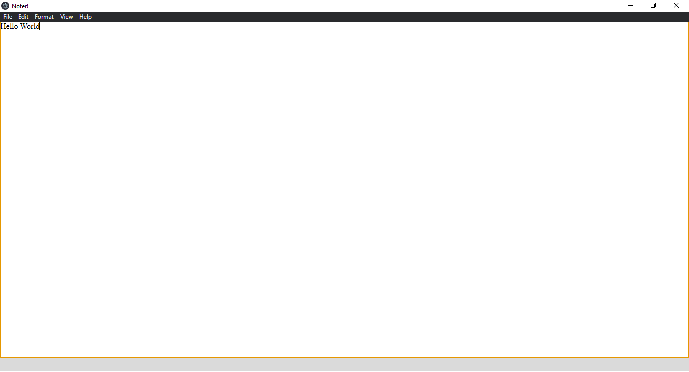
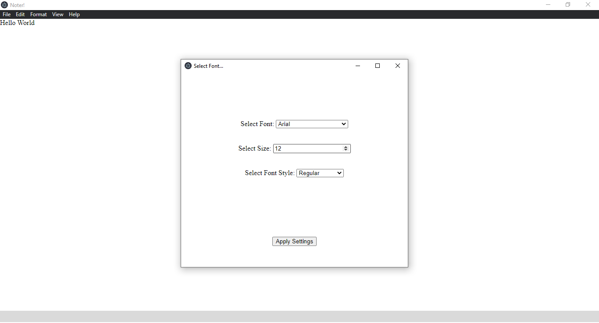

<!DOCTYPE html>
<html lang="en">
<head>
    <meta charset="UTF-8">
    <meta http-equiv="X-UA-Compatible" content="IE=edge">
    <meta name="viewport" content="width=device-width, initial-scale=1.0">
</head>
<body>
   <h1>Noter! App -Open Source </h1>
     
This is my first electron app. This is in alpha state. Your testing would be helpful.

  <h2>Noter App!</h2>
  </img>  
  </img>  
  
Enriched With wide variety of Fonts.

  <h2>Features Coming Up.</h2>
  
  <ul>
  <li>Themes</li>
  <li>Custom Title Bar. img</li>
  <li>Better Navigation</li>
  <li>More Accessibility</li>
  <li>And Many More...</li>
  </ul>
  <h2>More Projects</h2>
  
My Projects Are available on Itch.io. 

    
  
You can follow me on Itch.

  <h2>About Me.</h2>
  
I am an

  <ul>
    <li>Indie Game Developer</li>
    <li>Indie Web Developer</li>
    <li>Indie App Developer</li>
  </ul>
</body>
</html>
